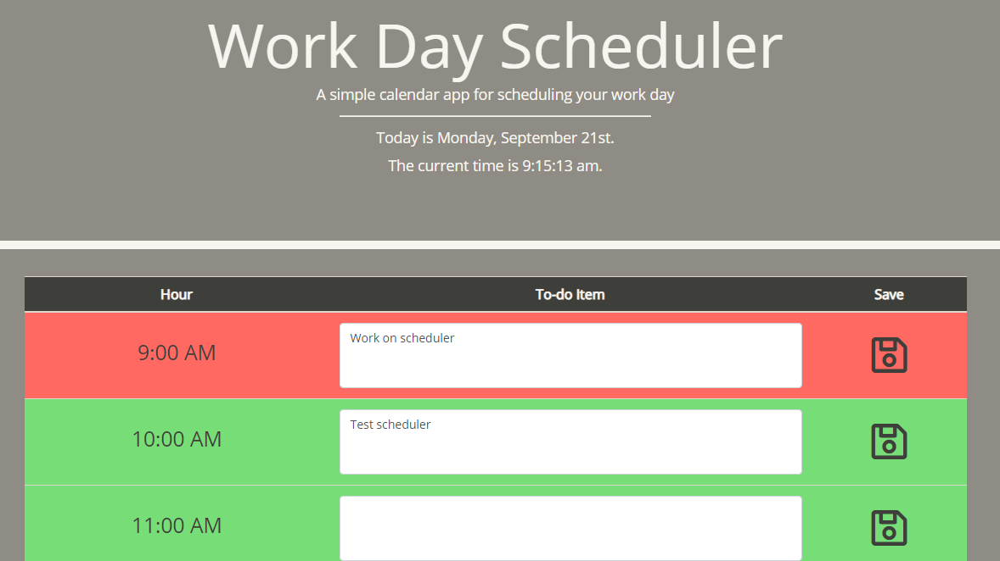

# Welcome to my Workday Scheduler

Create a simple calendar application that allows the user to save events for each hour of the day. This app will run in the browser and feature dynamically updated HTML and CSS powered by jQuery.

The Work Day Scheduler dynamically creates rows based on the users work hours (default 9am-5pm). If a time block is in the past, the box color is gray. If the box represents the current hour, the color is red. If the box represents time in the future, the color is green.

Each text box is tied to its own local storage and includes a save button. When the save button is clicked, the current contents of the text box of that row overwrites the local storage and updates the "todo" item (which will survive on reload)

[Check out the deployed app here!](https://markdcross.github.io/work-day-scheduler/)

# Technology/skills
* HTML
* CSS
* JavaScript
* jQuery
* moment.js
* Local storage

# Screenshots

# Contact
Please reach out to me with any questions or feedback via [GitHub](https://github.com/markdcross "Visit Mark's GitHub"), [LinkedIn](https://www.linkedin.com/in/markdcross/ "Visit Mark's LinkedIn"), or [Email](mailto:markdcross@gmail.com)

# License
MIT License

Copyright (c) 2020 Mark Cross

Permission is hereby granted, free of charge, to any person obtaining a copy of this software and associated documentation files (the "Software"), to deal in the Software without restriction, including without limitation the rights to use, copy, modify, merge, publish, distribute, sublicense, and/or sell copies of the Software, and to permit persons to whom the Software is furnished to do so, subject to the following conditions:

The above copyright notice and this permission notice shall be included in all copies or substantial portions of the Software.

THE SOFTWARE IS PROVIDED "AS IS", WITHOUT WARRANTY OF ANY KIND, EXPRESS OR IMPLIED, INCLUDING BUT NOT LIMITED TO THE WARRANTIES OF MERCHANTABILITY, FITNESS FOR A PARTICULAR PURPOSE AND NONINFRINGEMENT. IN NO EVENT SHALL THE AUTHORS OR COPYRIGHT HOLDERS BE LIABLE FOR ANY CLAIM, DAMAGES OR OTHER LIABILITY, WHETHER IN AN ACTION OF CONTRACT, TORT OR OTHERWISE, ARISING FROM, OUT OF OR IN CONNECTION WITH THE SOFTWARE OR THE USE OR OTHER DEALINGS IN THE SOFTWARE.
